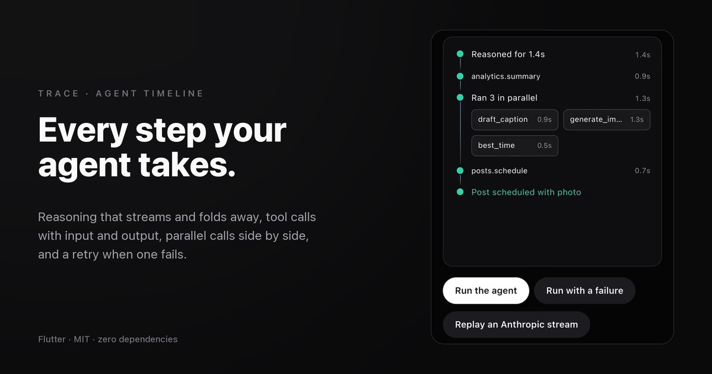

# Trace

An agent run timeline for Flutter. **Reasoning** streams in and folds away,
**tool calls** show their input and output, **parallel** calls run side by
side with their own progress, and **failures** offer a retry. Adapters read
OpenAI, Anthropic and Vercel AI SDK streams directly.

**[→ Live demo](https://yagnikbarasiya23.github.io/trace_agent_timeline/)** (the example app, built for the web)



No dependencies beyond Flutter. There's also a [web version](https://github.com/YagnikBarasiya23/trace-agent-timeline).

## Install

```yaml
dependencies:
  trace_agent_timeline:
    git:
      url: https://github.com/YagnikBarasiya23/trace_agent_timeline.git
```

Requires Flutter 3.47 or newer.

## Use it

```dart
import 'package:trace_agent_timeline/trace_agent_timeline.dart';

final trace = TraceController();

SizedBox(
  height: 360,
  child: Trace(controller: trace, onRetry: (step) { step.retry(); /* run it again */ }),
);

final think = trace.reasoning();
think.append('Check last month first…');
think.done();                                  // → "Reasoned for 1.3s"

final call = trace.tool('analytics.summary', args: {'days': 30});
call.done(result: {'reach': 7200});            // or call.fail('Timed out')

final group = trace.parallel();
group.tool('draft_caption');
group.tool('generate_image').progress(0.4);

trace.finish('Post scheduled');
```

### From a model stream

`fromEvents` takes decoded JSON events from any HTTP or SSE client:

```dart
final events = sseStream.map((e) => jsonDecode(e.data) as Map<String, dynamic>);

await trace.fromEvents(events, format: TraceFormat.anthropic, runTool: (name, args) => tools[name]!(args));
await trace.fromEvents(events, format: TraceFormat.openai, runTool: (name, args) => tools[name]!(args));
await trace.fromEvents(events, format: TraceFormat.aiSdk);   // results arrive in the stream
```

Tools that start before the previous one finishes are grouped into one
parallel step. Without `runTool`, tool steps stay running until you call
`trace.get(id)!.done(result: …)`.

## API

| Member | What it does |
| --- | --- |
| `reasoning({id})` | A streaming reasoning step: `append(text)`, then `done()` collapses it |
| `tool(name, {id, args})` | A tool call: `setArgs`, `done(result:)`, `fail(message)`, `cancel()` |
| `parallel([name])` | A group: `group.tool(...)` adds lanes, `lane.progress(0–1)` fills a lane's bar |
| `message(text)` | A plain note |
| `finish([text])` / `error(message)` | Ends the run |
| `get(id)`, `steps`, `isRunning` | Look things up |
| `fromEvents(stream, format:, runTool:)` | Plays an OpenAI, Anthropic or AI SDK stream |
| `announcements` | Sentences the widget announces to screen readers |

`Trace` takes `controller`, `onRetry`, `padding` and a `TraceThemeData`
(`accent`, `done`, `fail`, `textStyle`, `monoStyle`). Colours default to your
app's `ColorScheme`, so it fits light and dark themes.

## How it works

**Strict step states.** A step is running, then done, failed or cancelled.
Only a failed step can go back to running, through `retry()`. Illegal moves
throw a `StateError`.

**Pure adapters.** Each provider's events map to a small set of operations
(`reasoning.append`, `tool.start`, `tool.args`…), tested against recorded
streams. Anthropic runs that stop for a tool call continue in the next
message and finish only at the real end of the turn. A tool that gets moved
into a parallel group mid-stream still receives its result.

**One clock.** A single ticker refreshes every running step's timer ten
times a second and stops when nothing is running.

**Scroll that respects the reader.** The list follows new steps while you're
at the bottom. Scroll up and it stops, showing a "Jump to latest" pill.

**Accessible.** Headers are buttons with an expanded state, and tool results,
failures and the end of the run are announced. Reduce motion removes the
slide, pulse and shimmer.

## Run the demo

```bash
cd example
flutter run -d chrome
```

```bash
flutter test      # from the package root
```

## License

MIT © 2026 Yagnik Barasiya
